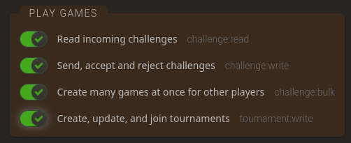

# Chess on Neovim

Inspired by `cli-chess` by trevorbayless

This is version 0.1.0 of the chess on neovim project

This version has support for
1. Multiplayer chess using lichess api
2. Playing against stockfish level 1 to 8
3. Joining currently ongoing games
4. All variant support for all variants on lichess
5. Multiple themes
6. Custom themes created from a single file

## Runtime Dependencies include:
1. berserk
2. chess
3. pynvim
4. python version >= 3.9 
5. neovim version >= 3.9 (versions below 3.9 have unexpected highlight issues)

for the pip related deps:
`pip3 install berserk chess pynvim`

## Instructions:

### To run
YOU WILL NEED AN API TOKEN TO PLAY!

Create an API TOKEN from lichess.org
with the following permissions:

To create a token head over to your `profile` and then to API Access Tokens and add a token 

clone the repo:
`git clone https://github.com/ap-berry/chess_on_neovim && cd chess_on_neovim`

run this command with your API TOKEN
`echo <API TOKEN> > gui_tests/.env`
replace `<API TOKEN>` with your token

install the dependencies and run a neovim instance from the terminal with the options --listen 127.0.0.1:6789
`nvim --listen 127.0.0.1:6789`

after that run the `gui_tests/threadingmain.py` python file from the repo directory `chess_on_neovim` in a separate terminal

`python3 gui_tests/threadingmain.py`

that should be it

the small windows on top of the board and stats when playing a game is the input window

it acts as console which takes inputs on Enter

currently these command are defined

| command | Action |
| -------- | ---------|
| 'menu' | Return to main menu|
| 'exit' | Kill the game windows and stop the python process |
| 'resign' | Resigns/Aborts the game |
| 'abort' | Resigns/Aborts the game |
| 'flip' | Flips the Board |

it treats all other inputs as making a move.
ALL MOVES ARE CASE-SENSITIVE AND MUST BE IN `SAN` NOTATION
e.g
1. e4 e5
2. Nf3 Nc6

### Issues / Missing Features:

1. Highlights make the board updates flicker when making moves [SOLVED]
2. Api requests can block the app due to not being async
3. Stats Window does not have highlights
4. Error Window has not themeing
5. Only supported on linux.
